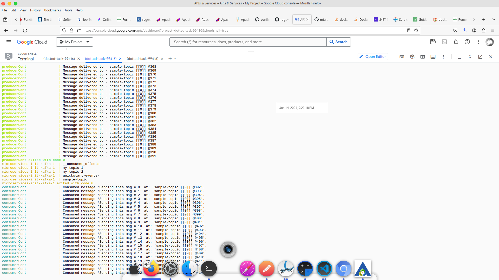

# Microservies architecture
This repo consists of sample api using the microservices architecture. One `srvcOne` api instance is run twice as two different services like in the `docker-compose.yml` to demonstrate microservices architecture.

There are the below service configured in the [docker-compose.yml](docker-compose.yml)

a. `Zookeeper` startup service for Apacke Kafka.
b. `Apache Kafka` service itself with additional service to create the topic.
c. Events `producer` service, producing about hundred(s) of events.
d. Events `consumer` service, to consume these events.

### Docker

The below command should bring all the services defined in the docker compose file and start running the `producer` and the `consumer` almost right away.

```
docker compose up
```

The below screen shows the docker log of the `producer` and the `consumer`.


